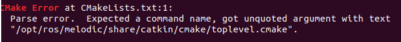

# Conde simulator setup
1. Just as before - make sure you have `ROS melodic` installed and running on `Ubuntu 18.04`.
2. Clone the repository:
```
git clone https://github.com/kolo-naukowe-ghost/ghost-racer.git
cd ghost-racer
git checkout conde_sim_setup
```
2. Theoretically you should be able to run `catkin_make` now, but in practice you may find yourself lacking some of the libraries and packages. First, install ackermann-msgs:
```
sudo apt-get install ros-melodic-ackermann-msgs
```
3. You'll need OpenCV version 3.X as well, follow this tutorial: https://www.pyimagesearch.com/2018/05/28/ubuntu-18-04-how-to-install-opencv/

4. If you run into error saying that module `rospkg` cannot be found, run:
```
pip install rospkg
```
5. You may also run into error saying, that you do not have `defusedxml` installed, so just run:
```
pip install defusedxml
```
6. Finally, you can `catkin_make` on your workspace.
7. To run the simulator, execute:
```
source devel/setup.bash
roslaunch autonomous_driving_world spawn_conde_in_competition_track_D1_D2_B1_P1.launch
```

In case of error during `catkin_make`:


Copy content from file mentioned in error to your src/CMakeList.txt

I also had a problem with permissions:
`chmod +x src/image_transport_plugins/compressed_depth_image_transport/cfg/CompressedDepthPublisher.cfg src/image_transport_plugins/compressed_image_transport/cfg/* src/image_transport_plugins/theora_image_transport/cfg/*`

Good luck! ;)
